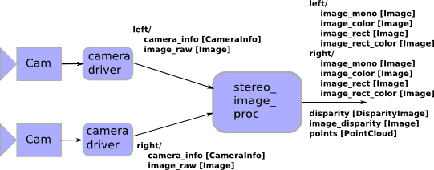

#
 Set up your laptop in Ubuntu

<big>*Zheng Rong  @ Dec. 5 2014*</big>

---------------------------------------------

## install Ubuntu

    sudo apt-get update
    sudo apt-get upgrade
---------------------------------------------    
## input method    
language support    
text entry setting  
preference setting  

----------------------------------------------
## set up the bash
[REF](https://help.ubuntu.com/community/CustomizingBashPrompt)  

    gedit ~/.bashrc   
    
>uncomment the line     
from  
    #force_color_prompt=yes     
to  
    force_color_prompt=yes
    
----------------------------------------------

## install logitech unifying
    sudo add-apt-repository ppa:daniel.pavel/solaar
    sudo apt-get update
    sudo apt-get install solaar

----------------------------------------------

## install　ROS
[ROS](www.ros.org)

----------------------------------------------

## install vim 
    sudo apt-get install vim      
*set up the vim*   

* create (or edit) the .vimrc file:   
    vim ~/.vimrc    
* paste the configuration below into the file.   

        set tabstop=4       " The width of a TAB is set to 4.
                            " Still it is a \t. It is just that
                            " Vim will interpret it to be having
                            " a width of 4.
        set shiftwidth=4    " Indents will have a width of 4
        set softtabstop=4   " Sets the number of columns for a TAB
        set expandtab       " Expand TABs to spaces
        " set nu
        syntax on
        set autoindent      " auto indent
    
* restart vim

----------------------------------------------

## install sublime-text-3 
    sudo add-apt-repository ppa:webupd8team/sublime-text-3
    sudo apt-get update
    sudo apt-get install sublime-text-installer

----------------------------------------------

## install others    
    sudo apt-get install tex-live
    sudo apt-get install tex-maker
    sudo apt-get install skype
    sudo apt-get install dropbox
    sudo apt-get install everpad
    sudo apt-get install Gparted
    sudo apt-get install partitionmanager
    sudo apt-get install retext

*retext is a editor based on Markdown* 
[how to use retex](https://github.com/LearnShare/Learning-Markdown)

----------------------------------------------

## follow Ellen's note

### install packages

    sudo apt-get install swig
    sudo apt-get install openjdk-7-jdk
    sudo apt-get install flex
    sudo apt-get install libboost-all-dev libboost-dev
    sudo apt-get install libgsl0-dev
    sudo apt-get install libeigen3-dev 
    sudo apt-get install libatlas-dev
    sudo apt-get install libatlas-base-dev
    sudo apt-get install libatlas3gf-base

<big>install Armadillo</big>

…by downloading it from the website, not via apt-get, and follow the instructions in the readme. Make sure to do all the –devs and parallel stuff it mentions.

http://arma.sourceforge.net/download.html

Update: Do NOT install OpenBLAS. 
OpenBLAS has a multi-threading affinity which results in the creation of threads when solving certain classes of problems. Unfortunately, this results in high overhead as the system rapidly creates, clones, and yields numerous threads. This issue is linux specific.

<big>install yaml-cpp package</big>

Again, download “yaml-cpp_0.5.1.tar.gz” from their website and install using the readme.

https://code.google.com/p/yaml-cpp/ 

###install bison
Go to [gnu project archives](http://ftp.gnu.org/gnu/bison)  
download the “bison-2.5.tar.gz”

    sudo apt-get install m4

go into bison-2.5/lib, open stdio.in.h, and find the following lines:

    /* It is very rare that the developer ever has full control of
    stdin, so any use of gets warrants an unconditional warning.
    Assume it is always declared, since it is required by C89.  */
    #if defined gets
    #undef gets
    _GL_WARN_ON_USE (gets, "gets is a security hole - use fgets 
    instead");
    #endif

Comment out or delete the above lines. Finally,

    ./configure
    make
    sudo make install

###install IPC
Download IPC & unpack it.
[IPC](http://www.cs.cmu.edu/~./IPC/)

Change IPC flag

set -fPIC flag as described on [ipc_bridge doc](https://github.com/nmichael/ipc_bridge)

Find the ipc-3.9.1/etc/GNUmakefile.defs file.

Go to line 371.

Change:

    $(CFLAGSM_$(DBMALLOC)) $(CFLAGS_EXT)

to be

    $(CFLAGSM_$(DBMALLOC)) $(CFLAGS_EXT) -fPIC

Now, Install IPC

    sudo make

(There are some errors displayed earlier in the make, but these do not appear to break the components we need)

manually copy some files to new folders

ipc3.9.*/{bin/Linux*, lib/Linux*, include} to /opt/ipc/{bin,lib,include} 

NOTE:   
Do NOT add "LINUX*" directory in the destination directory when copying files from ipc     

    ipc3.9.*/{bin/Linux*, lib/Linux*, include} 
    
to  

    /opt/ipc/{bin,lib,include} 

###install Matlab

----------------------------------------------

## install gperftools
[google performance tools]()

----------------------------------------------

## setup printer in FRC.RI.CMU

If you have an SCS account there are several ways to print:

The prefered method is here.    
In linux (Ubuntu):  
Go to System -> Administration -> Printing      
Click 'Add' 
Expand 'Network Printer'    
Select 'LPD/LPR Host or Printer'       
change the Host and Queue fields. Queue is the name of the printer.
   
####Printer IP	FQDN	Model	Location 	Host 
    
    boulder	
    128.2.177.195	
    boulder.prt.cs.cmu.edu	
    HP Color Laserjet 5550N	
    NSH 1100 (near FRC mailboxes)	
    cyan.srv.cs.cmu.edu
    
    lightning	
    128.2.177.194	
    lightning.prt.cs.cmu.edu	
    HP Laserjet 9000N	
    NSH 1200 (near e-lab)	
    cyan.srv.cs.cmu.edu
    
    mulch	
    128.2.177.211	
    mulch.prt.cs.cmu.edu	HP Laserjet 4350n	
    NSH 2200 (near FRC grad student offices and water cooler)	
    cyan.srv.cs.cmu.edu
    
    prismCOLOR	
    128.2.177.208	
    prismcolor.prt.cs.cmu.edu	
    HP Color Laserjet 5550DN	
    NSH 1509 (near NSH 1st floor copy room and RoboLounge)
    cyan.srv.cs.cmu.edu

----------------------------------------------

## install system monitor
    sudo add-apt-repository ppa:fossfreedom/indicator-sysmonitor
    sudo apt-get update
    sudo apt-get install indicator-sysmonitor
    sudo apt-get remove indicator-sysmonitor # to remove indicator sysmonitor
    sudo apt-get install indicator-multiload
 
 ----------------------------------------------
    
## use GitHub
### ssh key

    ls -al ~/.ssh
    ssh-keygen -t rsa -C "your_email@example.com"    
*start the ssh-agent in the background*
    eval "$(ssh-agent -s)"
    ssh-add ~/.ssh/id_rsa

### command set
    git add file-name
    git commit -m "commit message"
    git push
    
    git rm file-name
    git commit -m "remove a file"
    git push
    
    modify file-1
    git commit file-1 -m "modify this file"
    git push
    
    git add file-names
    git commit -a -m "creat"
    git push
 
 --------------------------------------------------------
    
## Wiki of px4
[px4 quick start](https://pixhawk.org/dev/px4_quickstart)
### NuttShell (NSH) via Seiral using the kermit:
[Ref](https://pixhawk.org/users/serial_connection)

    sudo apt-get install ckermit
    *Set your default settings to the correct settings for px4:*  
    echo "SET LINE /dev/ttyUSB0
    SET SPEED 57600
    SET CARRIER-WATCH OFF
    SET FLOW-CONTROL NONE" > ~/.kermrc
    
    ~/.kermrc
    ls /dev/ttyUSB*     
    sudo kermit
    connect
    enter

*command:*  

    ls 
    free 
    cd

*quit:* 
 
    Ctrl+\  
    C   
    quit

### build and flash the firmware 

    cd ~/src
    git clone https://github.com/PX4/Firmware
    cd Firmware
    *GitLab special start*
    git clone git@nmichael.frc.ri.cmu.edu:px4/px4_patches.git
    git checkout -b cmu_develop `cat px4_patches/px4_master_hash`
    git apply --ignore-space-change --ignore-whitespace px4_patches/px4_master_to_cmu_develop_version.diff
    rm -fr src/modules/cmu_rc_command src/modules/cmu_pwm_command src/modules/cmu_attitude_estimator_so3 src/modules/cmu_voltage_monitor
    git submodule add git@nmichael.frc.ri.cmu.edu:px4/cmu_rc_command.git src/modules/cmu_rc_command
    git submodule add git@nmichael.frc.ri.cmu.edu:px4/cmu_voltage_monitor.git src/modules/cmu_voltage_monitor
    git submodule add git@nmichael.frc.ri.cmu.edu:px4/cmu_attitude_estimator_so3.git src/modules/cmu_attitude_estimator_so3
    git clone https://github.com/PX4/NuttX
    *GitLab special end*
    
    git submodule init
    git submodule update
    
    *GitLab special*
    vim makefiles/config_px4fmu-v1_default.mk
    
    change line 129:
    From:
    MODULES                += modules/cmu_pwm_command
    To:
    #MODULES                += modules/cmu_pwm_command
    
    cd ~/src/Firmware
    make distclean
    make archives
    make
    sudo usermod -a -G dialout $USER
    Log out and log in in linux for changes to take effect. (Very Important!)
    make upload px4fmu-v1_default

The result should be:

working in [...]/Firmware/Images    
Attempting to flash PX4FMU board via USB    
Loaded firmware for 5,0, waiting for the bootloader...  

When you see “waiting for the bootloader” press the “reset” button on the side of the PX4FMU. If the board is now connected & reset, the new firmware will be flashed.  

Found board 5,0 on /dev/tty...  
erase...    
program...  
verify...   
done, rebooting.    

### Troubleshooting 
####Board not found (Affects mostly Ubuntu 12.10 users) 
In case the board is not found, make sure you remove the modem-manager by:  
    sudo apt-get remove modemmanager    

####Permission Denied
If you have no permissions for /dev/ttyACM0 , make sure the user is in group dialout (as described above).      

    sudo usermod -a -G dialout $USER     
         
Log out and log in in linux for changes to take effect. (Very Important!)

####To find out the device name (if not /dev/ttyACM0), do a
    ls /dev/tty*    
when the bootloader is loading (first 5 seconds after reset).

### install Qground control 

[Qgroundcontrol](http://qgroundcontrol.org/dev/build_source)

[github](https://github.com/mavlink/qgroundcontrol.git)

[installation instruction](https://github.com/mavlink/qgroundcontrol/blob/master/README.md)

### px4 serial port mapping
ttyS (definition in the px4/microSD/etc/rc.txt) 
HW (defined in the px4 hardware user manual)    

    ttyS0 <==> HW-UART1     
    ttyS1 <==> HW-UART2     
    ttyS2 <==> HW-UART5     
    ttyS3 <==> HW-UART6     

    UART_1 --- FTDI  
    pin3 --- black--ground
    pin7 --- yellow
    pin8 --- orange

### odroid cmu_mavlink 
    git clone cmu_mavlink
    ./update --devel
####trouble shooting 
[Ref](https://github.com/gitlabhq/gitlabhq/issues/4272#issuecomment-22074932)   
odroid sandbox update failed like this: 
[ 12%] Performing download step (git clone) for 'mavlink'   
Cloning into 'mavlink'...   
fatal: unable to access 'https://github.com/mavlink/mavlink.git/':   server certificate verification failed. CAfile: /etc/ssl/certs/ca-certificates.crt CRLfile: none   
solution:   
    git config --global http.sslverify false    
    

after the update:   
    catkin_make the dry;
    catkin_make the wet;

modify: vim cmu_mavlink/cmu_mavlink_only.launch     
    baudrate:230400     
    serialport:/dev/ttyUSB0

    roslaunch cmu_mavlink cmu_mavlink_only.launch
    rostopic list
    rostopic hz /mavlink/att
    rostopic echo /mavlink/att
---------------------------------------------------------------------
##Feedback control using Simulation via Matlab and IPC 

### download cmu_quad_matlab to sandbox
    git clone
    ./update  --devel
    
### compile the packages
solve the problem in vicon-mocap        
goto: cmu-quad-matlab/dry/src/vicon_mocap/libvicon_driver/

Change the following line:

Line 24:

from:   

    set(USE_OLD_YAML_CPP_API TRUE CACHE BOOL "Use the old YAML-CPP API")

to: 

    set(USE_OLD_YAML_CPP_API FALSE CACHE BOOL "Use the old YAML-CPP API")

catkin_make wet, it depends on some packages in dry, so before the compile we should source dry directory. (solution to problem "can't find mavlink".)
 
### . workon
mehtod_1: manually source:
    firstly souce dry, then source wet
    source ${TOP_DIR}/dry/install_isolated/setup.bash
    source ${TOP_DIR}/wet/devel/setup.bash
method_2: use workon
add --extend to the second source line to make sure it works correctly.
there is a space between . and workon in command line

### let ROS talk to IPC-bridge
    /opt/ipc/bin/central –u
### run Matlab.simple_io_test.m
    cd /cmu_quad_matlab/wet/src/matlab_quadrotor_example/matlab
*NOTE*   
*Be careful when trying to print out some information, which can greatly slow the processing speed.*
### run launch file
    cd cmu_quad_matlab/wet/src/matlab_quadrotor_example/launch
    roslaunch matlab_quadrotor_example simulation_test.launch
    rostopic list
    rostopic hz topic-name
    rostopic echo topic-name
###trouble shooting 
rostopic echo  /test/pd_cmd

ERROR: Cannot load message class for [quadrotor_msgs/PDCommand]. Are your messages built? 
      
solution: source the directory using . workon in current terminal

----------------------------------------------------

##Install mvBlueFOX camera driver on PC or Odroid

[Matrix Vision mvBlueFOX Ref](http://www.matrix-vision.com/manuals/mvBlueFOX/mvBF_page_quickstart.html)

[Driver for odroid](http://www.matrix-vision.com/industries-reader/embedded-boards-mvbluefox-drivers-for-odroid-raspberry-pi-and-wandboard.html)

[Driver for Linux](http://www.matrix-vision.com/latest-drivers.html)

#### install [expat-2.1.0](http://sourceforge.net/projects/expat/)
    
    mkdir build                 in the expat-2.1.0 project folder
    cd build
    cmake ..                    
    make
    sudo make install

    ./configure
    make
    sudo make install

#### install Linux camera driver mvBlueFOX-xxxxxxxxx

download 2 files and run the following command:
    chmod a+x install_mvBlueFOX.sh 
    ./install_mvBlueFOX.sh 

#### test using wxPropView
reboot  
test via wxPropView 

-----------------------------------------------------------------
## install ROS-camera driver matrixvision_camera on PC

1. git clone matrixvision_camera from ethz Github
    export ROS_PACKAGE_PATH=${ROS_PACKAGE_PATH}:~/ros_code/matrixvision_camera/
2. rosmake
3. add files and modify some code from Ke's matrixvision Gitlab
4. rosmake
5. modify the launch file in mv_camera (camera ID)
6. roslaunch launchfile-name
7. rostopic list make sure the stereo camera are publishing:
    
    /stereo/left/image_raw
    /stereo/left/camera_info
    /stereo/right/image_raw
    /stereo/right/camera_info

8. rostopic hz topic-name
9. rosrun image_view image_view image:=/stereo/left/image_raw

>Difference between Ke and ethz:
1. copy from Ke to ethz:
    mv_camera/  
    {  
        CMakeLists.txt  
        launch  
        Makefile    
        manifest.xml    
    }   
    mv_camera/src   
    {   
        modify_camera_settings.cpp  
        stereo_time_reporter.cpp  
    }     
2. comment some code:
    mv_camera/src/modify_camera_settings.cpp    
    comment the last 4 sessions(set master and slave mode)

copy camera calibration file
test image_view
test stereo_view

##Install ROS-camera driver on Odroid
Before this step, we should install mvBlueFOX driver firstly.   
1. git clone matrixvision_camera from ethz Github
    export ROS_PACKAGE_PATH=${ROS_PACKAGE_PATH}:~/ros_code/matrixvision_camera/     
2. modify the make.sh file in the mv_driver folder   ---Arkin   see attached    
3. copy 4 folder from mv_driver/mvIMPACT_acquire to /opt/ros/indigo/include 
    DriverBase, mvDeviceManager, mvIMPACT_CPP, mvPropHandling
    sudo cp -r source-directory dest-directory  
*Note: the folder mv_driver/mvIMPACT_acquire will not exist until we rosmake it in directory matrixviaion_camera, but this rosmake will have some error.*   
4. rosmake it again, then it passed.    
5. modify the code according to Ke's code component 
6. rosmake  
7. install ros-indigo-image-view package    
8. modify the launch file in the mv_camera for the two cameras UID  
9. roslaunch launchfile     
10. rostopic list       
11. rosrun image_view image_view image:=/stereo/left/image_raw  

>Difference between Ke and ethz:
1. copy from Ke to ethz:
    mv_camera/  
    {  
        CMakeLists.txt  
        launch  
        Makefile    
        manifest.xml    
    }   
    mv_camera/src   
    {   
        modify_camera_settings.cpp  
        stereo_time_reporter.cpp  
    }     
2. comment some code:
    mv_camera/src/modify_camera_settings.cpp    
    comment the last 4 sessions(set master and slave mode)
    
*make.sh*    

        #!/bin/bash   
        #This make.sh is for Odroid armv7l. Zheng Rong Nov 10 2014
        
        set -e
        
        PACKAGE_DIR=$(rospack find mv_driver)
        echo "### downloading and unpacking drivers to" $PACKAGE_DIR "###"
        
        BLUEFOX_URL="http://www.matrix-vision.com/industries-reader/embedded-boards-mvbluefox-drivers-for-odroid-raspberry-pi-and-wandboard.html?file=tl_files/mv11/support/mvIMPACT_Acquire_Embedded"
        
        API=mvIMPACT_acquire
        
        LINKER_PATHS=$PACKAGE_DIR/linker_paths
        COMPILER_FLAGS=$PACKAGE_DIR/compile_flags
        
        BLUEFOX_NAME=mvBlueFOX
        TARGET=armv7l
        BLUEFOX_VERSION=2.6.3
        BLUEFOX_TARNAME=$BLUEFOX_NAME-$TARGET-$BLUEFOX_VERSION
        
        # cleanup first
        rm -rf $BLUEFOX_NAME* $API* tmp $LINKER_PATHS $COMPILER_FLAGS
        rm -rf download
        #### download driver archives ####
        mkdir -p download
        cd download
        wget -O $BLUEFOX_TARNAME.tgz -nc $BLUEFOX_URL/$BLUEFOX_TARNAME.tgz
        
        #### bluefox runtime ####
        # unpack
        mkdir -p $PACKAGE_DIR/tmp/$BLUEFOX_NAME
        cd $PACKAGE_DIR/tmp/$BLUEFOX_NAME
        tar -xf $PACKAGE_DIR/download/$BLUEFOX_TARNAME.tgz --overwrite
        
        # copy blueFOX runtime libs
        mkdir -p $PACKAGE_DIR/$BLUEFOX_NAME"_runtime/lib/"$TARGET
        cp $PACKAGE_DIR/tmp/$BLUEFOX_NAME/$API-$TARGET-$BLUEFOX_VERSION/lib/$TARGET/libmvBlueFOX.* $PACKAGE_DIR/$BLUEFOX_NAME"_runtime/lib/"$TARGET
        
        # copy udev rule
        mkdir -p $PACKAGE_DIR/$BLUEFOX_NAME"_scripts"
        cp $PACKAGE_DIR/tmp/$BLUEFOX_NAME/$API-$TARGET-$BLUEFOX_VERSION/Scripts/51-mvbf.rules $PACKAGE_DIR/$BLUEFOX_NAME"_scripts"
        
        echo -L$PACKAGE_DIR/$BLUEFOX_NAME"_runtime/lib/"$TARGET >> $LINKER_PATHS
        
        ##### mvIMPACT (device independent stuff) #####===============  Arkin --Nov 11 2014
        cd $PACKAGE_DIR
        mv $PACKAGE_DIR/tmp/$BLUEFOX_NAME/$API-$TARGET-$BLUEFOX_VERSION $PACKAGE_DIR/$API
        echo -L$PACKAGE_DIR/$API/lib/$TARGET >> $LINKER_PATHS
        echo -I$PACKAGE_DIR/$API >> $COMPILER_FLAGS
            
        #### clean up ####
        rm -rf $PACKAGE_DIR/tmp
        
        #### note down that this is done ####
        touch $PACKAGE_DIR/downloadandinstall

-----------------------------------------------------------------------
## Sychronization of the stereo camera

Here are the connections we have for stereo cameras 

The pin number follows the [link](http://www.matrix-vision.com/manuals/mvBlueFOX/mvBF_page_tech.html#mvBF_subsection_single)

Left: Master        
Right: Slave

L7 -> L10
L9 -> R12
L8 -> R8 & R11

L: left, R:right (left camera is the one on your left when you stand behind the stereo camera pairs).

In the camera driver mv_camera:
The cpp file "modify_camera_settings" should contain the stereo camera sync code(master and slave).

-----------------------------------------------------------------------
## using Stereo Image proc & Image proc
Packages: Image view, Stereo image proc, Image proc

After running the camera driver (mv_stereo.launch, in matrixvision_camera/mv_camera):

1. rostopic list make sure the stereo camera are publishing:
   
    /stereo/left/image_raw
    /stereo/left/camera_info
    /stereo/right/image_raw
    /stereo/right/camera_info

2. start stereo_image_proc in another terminal:     
    ROS_NAMESPACE=stereo rosrun stereo_image_proc stereo_image_proc _approximate_sync:=True    
3. rostopic list
4. rostopic hz topic-name
5. see the iamge:       
    *image_view has 3 nodes: image_view, stereo_view, disparity_view*      
        

    rosrun image_view image_view image:=/stereo/left/image_raw  
    rosrun image_view stereo_view stereo:=/stereo image:=image_raw _approximate_sync:=True      
    rosrun image_view stereo_view stereo:=/stereo image:=image_rect _approximate_sync:=True     
    rosrun image_view disparity_view image:=/stereo/disparity       

Image_proc is for mono camera, and has 1 node: image_proc.

function: remove camera distortion, convert format

make sure the camera driver is running.

    rostopic list | grep image_raw
    ROS_NAMESPACE=stereo/left rosrun image_proc image_proc
    rosrun image_view image_view image:=stereo/left/image_raw
    rosrun image_view image_view image:=stereo/left/image_rect
----------------------------------------------------------------
## Calibration for Stereo /Mono Camera 

1. make sure the installation of camera_calibration             
    rosdep install camera_calibration
    rosmake camera_calibration
    
2. run the mv_stereo to start the stereo camera           
    export ROS_PACKAGE_PATH=${ROS_PACKAGE_PATH}:~/ros_code/matrixvision_camera/
    roslaunch mv_camera.launch
    
3. check the topic      
    rostopic list
    
4. run the calibration node     

    *Stereo*  
          
    rosrun camera_calibration cameracalibrator.py --size 8x6 --square 0.152 --approximate=0.01 right:=/stereo/right/image_raw left:=/stereo/left/image_raw right_camera:=/stereo/right left_camera:=/stereo/left
    
    *Mono*   
       
    rosrun camera_calibration cameracalibrator.py --size 8x6 --square 0.152 image:=/stereo/left/image_raw camera:=/stereo/left     
         
5. camera check

    rosrun camera_calibration cameracheck.py --size 8x6 stereo:=/wide_stereo image:=image_rect
    
    rosrun camera_calibration cameracheck.py --size 8x6 monocular:=/forearm image:=image_rect

6. check the stereo camera synchronization      
    rosrun mv_camera stereo_time_reporter
    
-----------------------------------------------------------
## Record dataset as bagfile for SVO

In the SVO package launch folder, there are several launch files:

    svo_bag.launch              *use dataset to test SVO algorithm and output results(bagfile)*
    svo_imu_stereo_bag.launch   *record dataset as bagfile*
    svo_imu_stereo.launch       *camera driver for stereo configuration*
    svo_online.launch           *online svo*
    svo_stereo_proc.launch      *start stereo image processing*

1. run the camera driver

        roslaunch svo_imu_stereo.launch
        The node "cam_configurer" should be under the group with namespace "vehicle".
        In the matrixvision_camera/mv_camera/src/, the cpp file "modify_camera_settings" should contain the stereo camera sync code(master and slave).
        in the stereo_visual_odometry/wet/src/stereo_visual_odometry/config folder, there should be mv_camera-ID.yaml.
   
2. run stereo image proc

        roslaunch svo_stereo_proc.launch
     
3. run recording process

        roslaunch svo_imu_stereo_bag.launch bagfile:=pc_svo_nov17_6
     
You can specify the folder path of the bagfile output.

In the stereo_visual_odometry/wet/src/stereo_visual_odometry/config/oscar_camera_parameters.yaml, the projection matrices should be modified to match with the camera calibration result.

In the svo/src/visualOdometry.cpp  choose if dispaly the visual_feature_tracking

--------------------------------------------------------

## Run sandbox/stereo_visual_odometry using bag-file

1. mkdir sandbox

        cd sandbox  
        git clone URL       
        git branch -a       
        git checkout -d branchname      
        git branch      
        git diff        
        git fetch       
        git pull        
        git status      
        cd stereo_visual_odometry       
        ./update --devel        

2. set ROS_PACKAGE_PATH

    cd wet      
    source devel/setup.bash     
    env | grep ROS      
    
    *bug solution*
     
    unset ROS_PACKAGE_PATH      
    remove the build folder     
    rebuild     
    
    *other methods*
      
    . workon      
    export ROS_PACKAGE_PATH=${ROS_PACKAGE_PATH}:~/sandbox/svo/wet       
    
3. make     
    catkin_make -DCMAKE_BUILD_TYPE=Release

4. roslaunch        
    modify the launch file to fit for the bag file      
    sandbox/svo/wet/src/svo/launch/     
    roslaunch launch_name   
        
5. rostopic
    rostopic list       
    rostopic hz topic_name      
    rostopic echo topic_name      
      
6. rosnode
    rosbag info bag_name        
    rosnode list        
    rosnode info node_name      
    
7. rosrun
    rosrun rviz rviz -d xxx.rviz   
    
-------------------------------------------------
## use the CPU_monitor to get CPU usage information on Odroid

1. download the package cpu_monitor and put it in the package collection folder
    cd sandbox/svo/wet/src
    git clone URL
    
2. install needed glibtop library   
    sudo apt-get install libglib2.0-dev libgtop2-dev
    
3. make it  
    catkin_make --pkg cpu_monitor     #just make the specified package
    
4. modify the launch file

5. roslaunch svo_bag.launch output:=... input:=...  

    rosbag info test_2014-11-14-11-15-33.bag
    rosbag play test_2014-11-14-11-15-33.bag
    rostopic echo /oscar/cpu_monitor/cpu_status
    
6. use Matlab slam_test_suite to plot the CPU usage.

----------------------------------------------------
## use the google performance tool <u>gperftools</u>

1. download 
    [gperftools-2.1.tar.gz](https://code.google.com/p/gperftools/downloads/list)

2. install [libunwind](http://download.savannah.gnu.org/releases/libunwind/libunwind-0.99-beta.tar.gz)

    ./configure

    Error when making libunwind:        
    /usr/include/bits/setjmp2.h:26: error: ‘longjmp’ aliased to undefined symbol ‘_longjmp’

    Solution: modify the makefile       
    libunwind-1.0.1/src/Makefile        
    add U_FORTIFY_SOURCE for the CPPFLAGS on line 608.      

    before: CPPFLAGS =  -D_GNU_SOURCE -DNDEBUG      
    after:  CPPFLAGS =  -D_GNU_SOURCE -DNDEBUG -U_FORTIFY_SOURCE

    [Ref](http://blog.csdn.net/littletigerat/article/details/7738731)

3. install [gperftools](https://code.google.com/p/gperftools/source/browse/INSTALL)

    install command sequence:       
    ./configure     
    make        
    make install        
    export LD_LIBRARY_PATH=${LD_LIBRARY_PATH}:/usr/local/lib        

4. [use](http://gperftools.googlecode.com/svn/trunk/doc/cpuprofile.html)

#### Example from Nate :-)

1. In CMakeLists, add link flags "profiler" and "tcmalloc"

        target_link_libraries(${PROJECT_NAME) ${catkin_LIBRARIES} ... profiler tcmalloc}

2. In the entry point of your programme(i.e. stereo_visual_odometry_bag_process.cc) 
    
        #include <gperftools/profiler.h>     

3. Wrap the entire node with: (should use the top level cc file)

        int main(int argc, char** argv)
        {
            ProfilerStart("output_file_name");
            ....
            ProfilerStop();
            return EXIT_SUCCESS;
        }

4. Recompile with flag -DCPUPROFILE_FREQUENCY=1000

        catkin_make -DCPUPROFILE_FREQUENCY=1000

5. roslaunch the launch file and wait for completion

6. you will find the output_file_name.prof

        cd ~/.ros/

7. text output of the CPU analysis result

        pprof --text ~/ros_code/sandbox/stereo_visual_odometry/wet/devel/lib/stereo_visual_odometry/stereo_visual_odometry_bag_process output_file_name.prof

8. graphical output you can do

        pprof --gv ~/ros_code/sandbox/stereo_visual_odometry/wet/devel/lib/stereo_visual_odometry/stereo_visual_odometry_bag_process output_file_name.prof  
        
*Add link flags*
rosbuild_add_link_flags()
http://wiki.ros.org/rosbuild/CMakeLists/Examples

rosbuild_add_link_flags(target flags) :
http://wiki.ros.org/rosbuild/CMakeLists#rosbuild_add_link_flags

ROS_LINK_FLAGS:
http://wiki.ros.org/rosbuild
----------------------------------------------------------------------------
## Set up ROS connection between two computers through ssh
Master <= ROS => Slave

*Note: all the operation can be done on the laptop.*

* Laptop:    

        ssh odroid@192.168.10.101(eth0) 200(wlan0)
        
* Odroid terminal: (Master)

        roscore
        export ROS_IP=192.....
        export ROS_HOSTNAME=${ROS_IP}
        export ROS_MASTER_URI=http://${ROS_IP}:11311
        
* Laptop terminal:

        export ROS_IP=laptop's IP
        export ROS_HOSTNAME=${laptop's ROS_IP}
        export ROS_MASTER_URI=http://${odroid's ROS_IP}:11311
         
* In ssh connection:

     use scy command to copy file
     
        scp source_file odroid@192.168.10.101:~/.ros/camera_info/
-----------------------------------------------------------------   

## write launch file

#### Vicon
NOTE: 

the remap name from "~vicon" in "vicon_odom" must be the same with the name of topic "vicon" publishes.
This will connect node "vicon" with node "vicon_odom".
"vicon" publish the topic /vicon/base_obj with the type of vicon/subject
"vicon_odom" should subscribe the /vicon/base_obj and then
"vicon_odom" can publish the topic /vicon/odom with the type of nav_msg/Odometry

        <!-- Vicon system, publish /vicon/base_obj -->
        <node   pkg="vicon"
                type="vicon"
                name="vicon"
                output="screen">
        <param name="vicon_server" value="192.168.10.1"/>
        </node>
        <!-- publish /vicon/base_obj -->
        
        <!-- Specify a Vicon object -->
        
        <node   pkg="vicon_odom"
                type="vicon_odom"
                name="$(arg baseline)_vicon_odom"
                output="screen">
        <param name="frame_id/fixed" value="vicon"/>
        <param name="frame_id/base" value="$(arg baseline)/base"/>
        <remap from="~vicon" to="/vicon/base_obj"/>
        <remap from="~odom" to="/vicon/odom"/>
        </node>

    
    
