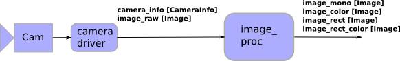

#
 Set up your laptop in Ubuntu

<big>*Zheng Rong  @ Dec. 5 2014*</big>

[link1](html-export.html)

---------------------------------------------

## install Ubuntu

        sudo apt-get update
        sudo apt-get upgrade
        
## System info

        uname -a
        uname -m
        arch
        
## make Ubuntu OS on Odroid

1. Download U2/3 Ubuntu 14.04 Trusty Dev Center 
[UPDATED 29/08/2014](http://forum.odroid.com/viewtopic.php?f=29&t=4823)
[older version](  http://com.odroid.com/sigong/nf_file_board/nfile_board_view.php?keyword=&tag=&bid=234)
    
2. Install instruction: 
[SD card set-up for ODROID](    http://com.odroid.com/sigong/blog/blog_list.php?bid=130)
     
3. Copy the ubuntu from a boot-able SD to file and copy the iso file to a SD card

         sudo dd if=/dev/mmcblk0 of=sd_copy.iso bs=512k
         sudo dd if=sd_copy.iso of=/dev/mmcblk0 bs=512k
         
4. Odroid Wiki:
     
[wiki](http://odroid.com/dokuwiki/doku.php)
 
5. solve the internet access problem

    Internet access: nameserver problem
    set your /etc/resolv.conf with nameserver 8.8.8.8 or your router's IP .
    
6. check md5sum

        md5sum ubuntu-11.10-dvd-i386.iso
        
MD5sum:
 1、使用md5sum来产生指纹（报文摘要）命令如下： 
 md5sum file > file.md5 
 或者 
 md5sum file >>file.md5 
 也可以把多个文件的报文摘要输出到一个md5文件中，这要使用通配符*，比如某目录下有几个iso文件，要把这几个iso文件的摘要输出到iso.md5文件中，命令如下： 
 md5sum *.iso > iso.md5
 
 2、使用md5报文摘要验证文件，方法有二： 
 把   下载   的文件file和该文件的file.md5报文摘要文件放在同一个目录下，然后用如下命令进行验证： 
 md5sum -c file.md5 
 然后如果验证成功，则会输出:正确 

文件: C:\Users\Arkin\Desktop\ubuntu-14.04.1lts-lubuntu-odroid-u-20140814.img.xz      
大小: 1524247232 字节      
修改时间: Monday, October 06, 2014, 2:23:43 PM      
MD5: F0D0B3F24D3D02394CF6F61D828CCA6C      
SHA1: 5924A62E69DC042D8F98F5D1778645D937B2E96E      
CRC32: B7F95D64  

## Copying an image to the SD Card in Linux (command line)

    1. Download a zipped image 

    2. Extract the image, with (just an example)
        unzip ~/OdroidX_image_31-Jul-2012.zip 

    3. Run df -h to see what devices are currently mounted 
    If your computer has a slot for SD cards, insert the card. 
Run df -h again. The device that wasn't there last time is your SD card. The left column gives the device name of your SD card. It will be listed as something like "/dev/mmcblk0p1" or "/dev/sdd1". The last part ("p1" or "1" respectively) is the partition number, but you want to write to the whole SD card, not just one partition, so you need to remove that part from the name (getting for example "/dev/mmcblk0" or "/dev/sdd") as the device for the whole SD card. Note that the SD card can show up more than once in the output of df: in fact it will if you have previously written a ODROID image to this SD card, because the ODROID SD images have more than one partition.
    Now that you've noted what the device name is, you need to unmount it so that files can't be read or written to the SD card while you are copying over the SD image. So run the command below, replacing "/dev/sdd1" with whatever your SD card's device name is (including the partition number)
        umount /dev/sdd1
    Note that if you are not logged in as root you will need to prefix this with sudo
    If your SD card shows up more than once in the output of df due to having multiple partitions on the SD card, you should unmount all of these partitions. 

    4. In the terminal write the image to the card with this command, making sure you replace the input file if= argument with the path to your .img file, and the "/dev/sdd" in the output file of= argument with the right device name (this is very important: you will lose all data on the hard drive on your computer if you get the wrong device name). Make sure the device name is the name of the whole SD card as described above, not just a partition of it (for example, sdd, not sdds1 or sddp1, or mmcblk0 not mmcblk0p1)
        dd bs=1M if=ODROID-X_31_07_2012.img of=/dev/sdd
        
    Note that if you are not logged in as root you will need to prefix this with sudo
    
    The dd command does not give any information of its progress and so may appear to have frozen. It could take more than five minutes to finish writing to the card. If your card reader has an LED it may blink during the write process, or you can run pkill -USR1 -n -x dd in another terminal (prefixed with sudo if you are not logged in as root). 
    As root run the command sync or if a normal user run sudo sync (this will ensure the write cache is flushed and that it is safe to unmount your SD card)

5. Remove SD card from card reader, insert it in the ODROID, and have fun 

## Copying an image to the SD Card in Linux (graphical interface)

If you are using Ubuntu and hesitate to use the terminal, you can use the ImageWriter tool (nice graphical user interface) to write the .img file to the SD card.

    1. Download a zipped image from this link or other mirrors
        http://com.odroid.com/sigong/nf_file_board/nfile_board.php 
    2. Right click the zip file and select "Extract here"
    
        *ATTENTION: As of this writing (15 June 2012), there is a bug in the ImageWriter program that causes it to fail if the filename of the image file or its path (i.e. all the names of any parent folders that you extract the image file into) contain any space characters. Before going any further, ensure that neither the file name of the image you're using or the path contain any spaces (or other odd characters, for that matter). A bug has been opened for this issue: https://bugs.launchpad.net/usb-imagewriter/+bug/1013834 Once the issue is fixed, edit this page to advise people to use an updated/patched version of ImageWriter.*
        
    3. Insert the SD card into your computer or connect the SD card reader with the SD card inside
    4. Install the ImageWriter tool from the Ubuntu Software Center. 
    5. Launch the ImageWriter tool (it needs your administrative password)
    6. Select the image file (example ODROID-X_31_07_2012.img) to be written to the SD card (note: because you started ImageWriter as administrator the starting point when selecting the image file is the administrator's home folder so you need to change to your own home folder to select the image file)
    7. Select the target device to write the image to (your device will be something like "/dev/mmcblk0" or "/dev/sdc")
    8. Click the "Write to device" button
    9. Wait for the process to finish and then insert the SD card in the ODROID

## Manually resizing the SD card partitions (Optional)
    use:        
        Gparted
        partitionmanager

--------------------------------------------

## Ubuntu on MAC

http://linux.cn/article-3245-1.html
https://help.ubuntu.com/community/MacBookPro

double disk in mac mini
http://nb.zol.com.cn/367/3671091.html
https://www.ifixit.com/Guide/Installing+Mac+Mini+Late+2012+Dual+Hard+Drive+Kit/11713

some setup for Ubuntu
        
--------------------------------------------- 
   
## input method   
 
        language support    
        text entry setting  
        preference setting  

---------------------------------------------

## Set/update time and date

* update with Internet

        sudo ntpdate time.nist.gov 
        
*other servers include time.windows.com, [here](http://www.pool.ntp.org/) lists time servers around the world.*

* set
        sudo date --set "25 Sep 2013 15:00:00"  
        sudo date 010224311971.59   
        sudo date --set="1971-01-02 24:31:59.990"  && date --rfc-3339=ns    
        
---------------------------------------------

## Commands about packages

find the installed packages: (example yaml)

        dpkg --get-selections | grep yaml

show the information about a package

        dpkg -s package-name

To get a list of packages installed locally

        dpkg --get-selections | grep -v deinstall

To save that list to a text file 

        dpkg --get-selections | grep -v deinstall > ~/Desktop/packages
        
----------------------------------------------
## set up the bash

[REF](https://help.ubuntu.com/community/CustomizingBashPrompt) 
 
[using the attached file](dot-bashrc)

    gedit ~/.bashrc   
    
>uncomment the line     
from  
    #force_color_prompt=yes     
to  
    force_color_prompt=yes
    
----------------------------------------------

## install logitech unifying

        sudo add-apt-repository ppa:daniel.pavel/solaar
        sudo apt-get update
        sudo apt-get install solaar

----------------------------------------------

## install　ROS
[ROS](www.ros.org)

----------------------------------------------

## install vim 

        sudo apt-get install vim      
        
*set up the vim*   

* create (or edit) the .vimrc file:   

        vim ~/.vimrc    
        
* paste the configuration below into the file.   

        set tabstop=4       " The width of a TAB is set to 4.
                            " Still it is a \t. It is just that
                            " Vim will interpret it to be having
                            " a width of 4.
        set shiftwidth=4    " Indents will have a width of 4
        set softtabstop=4   " Sets the number of columns for a TAB
        set expandtab       " Expand TABs to spaces
        " set nu
        syntax on
        set autoindent      " auto indent
    
* restart vim

----------------------------------------------

## install adobe reader

        acrobat adobe reader
        ardownload.adobe.com/pub/adobe/reader/unix/9.x/9.5.5/enu/AdbeRdr9.5.5-1_i386linux_enu.deb
        
----------------------------------------------

## install sublime-text-3 

        sudo add-apt-repository ppa:webupd8team/sublime-text-3
        sudo apt-get update
        sudo apt-get install sublime-text-installer

----------------------------------------------

## install others   
 
        sudo apt-get install tex-live
        sudo apt-get install tex-maker
        sudo apt-get install skype
        sudo apt-get install dropbox
        sudo apt-get install everpad
        sudo apt-get install Gparted
        sudo apt-get install partitionmanager
        sudo apt-get install retext
        sudo apt-get install kazam
        sudo add-apt-repository ppa:maarten-baert/simplescreenrecorder
        sudo apt-get update && sudo apt-get install simplescreenrecorder

*retext is a editor based on Markdown* 
[how to use retex](https://github.com/LearnShare/Learning-Markdown)

----------------------------------------------

## install packages

        sudo apt-get install swig
        sudo apt-get install openjdk-7-jdk
        sudo apt-get install flex
        sudo apt-get install libboost-all-dev libboost-dev
        sudo apt-get install libgsl0-dev
        sudo apt-get install libeigen3-dev 
        sudo apt-get install libatlas-dev
        sudo apt-get install libatlas-base-dev
        sudo apt-get install libatlas3gf-base
        sudo apt-get install libglib2.0-dev libgtop2-dev
        sudo apt-get install ros-indigo-tf2-ros
        sudo apt-get install ros-indigo-pcl-conversions
        sudo apt-get install ros-indigo-image-geometry
        sudo apt-get install ros-indigo-cv-bridge
        sudo apt-get install ros-indigo-pcl-ros
        sudo apt-get install ros-indigo-camera-info-manager
        sudo apt-get install ros-indigo-driver-base
        
        
        install PCL:
        sudo add-apt-repository ppa:v-launchpad-jochen-sprickerhof-de/pcl
        sudo apt-get update
        sudo apt-get install libpcl-all

<big>install Armadillo</big>

…by downloading it from the website, not via apt-get, and follow the instructions in the readme. Make sure to do all the –devs and parallel stuff it mentions.

http://arma.sourceforge.net/download.html

sudo apt-get install liblapack-dev liblapack3gf liblapack-pic liblapack-test

sudo apt-get install libarpack++2-dev libarpack++2c2a libarpack2 libarpack2-dbg libarpack2-dev

Update: Do NOT install OpenBLAS. 
OpenBLAS has a multi-threading affinity which results in the creation of threads when solving certain classes of problems. Unfortunately, this results in high overhead as the system rapidly creates, clones, and yields numerous threads. This issue is linux specific.

<big>install yaml-cpp package</big>

Again, download “yaml-cpp_0.5.1.tar.gz” from their website and install using the readme.

https://code.google.com/p/yaml-cpp/ 

###install bison

Go to [gnu project archives](http://ftp.gnu.org/gnu/bison)  
download the “bison-2.5.tar.gz”

    sudo apt-get install m4

go into bison-2.5/lib, open stdio.in.h, and find the following lines:

    /* It is very rare that the developer ever has full control of
    stdin, so any use of gets warrants an unconditional warning.
    Assume it is always declared, since it is required by C89.  */
    #if defined gets
    #undef gets
    _GL_WARN_ON_USE (gets, "gets is a security hole - use fgets 
    instead");
    #endif

Comment out or delete the above lines. Finally,

    ./configure
    make
    sudo make install

###install IPC
Download IPC & unpack it.
[IPC](http://www.cs.cmu.edu/~./IPC/)

Change IPC flag

set -fPIC flag as described on [ipc_bridge doc](https://github.com/nmichael/ipc_bridge)

Find the ipc-3.9.1/etc/GNUmakefile.defs file.

Go to line 371.

Change:

    $(CFLAGSM_$(DBMALLOC)) $(CFLAGS_EXT)

to be

    $(CFLAGSM_$(DBMALLOC)) $(CFLAGS_EXT) -fPIC

Now, Install IPC

    sudo make

(There are some errors displayed earlier in the make, but these do not appear to break the components we need)

manually copy some files to new folders

ipc3.9.*/{bin/Linux*, lib/Linux*, include} to /opt/ipc/{bin,lib,include} 

NOTE:   
Do NOT add "LINUX*" directory in the destination directory when copying files from ipc     

    ipc3.9.*/{bin/Linux*, lib/Linux*, include} 
    
to  

    /opt/ipc/{bin,lib,include} 

###install Matlab

use your own Matlab install file

----------------------------------------------

## setup printer in FRC.RI.CMU

If you have an SCS account there are several ways to print:

The prefered method is here.    
In linux (Ubuntu):  
Go to System -> Administration -> Printing      
Click 'Add' 
Expand 'Network Printer'    
Select 'LPD/LPR Host or Printer'       
change the Host and Queue fields. Queue is the name of the printer.
   
####Printer IP	FQDN	Model	Location 	Host 
    
    boulder	
    128.2.177.195	
    boulder.prt.cs.cmu.edu	
    HP Color Laserjet 5550N	
    NSH 1100 (near FRC mailboxes)	
    cyan.srv.cs.cmu.edu
    
    lightning	
    128.2.177.194	
    lightning.prt.cs.cmu.edu	
    HP Laserjet 9000N	
    NSH 1200 (near e-lab)	
    cyan.srv.cs.cmu.edu
    
    mulch	
    128.2.177.211	
    mulch.prt.cs.cmu.edu	HP Laserjet 4350n	
    NSH 2200 (near FRC grad student offices and water cooler)	
    cyan.srv.cs.cmu.edu
    
    prismCOLOR	
    128.2.177.208	
    prismcolor.prt.cs.cmu.edu	
    HP Color Laserjet 5550DN	
    NSH 1509 (near NSH 1st floor copy room and RoboLounge)
    cyan.srv.cs.cmu.edu

----------------------------------------------

## install system monitor

        sudo add-apt-repository ppa:fossfreedom/indicator-sysmonitor
        sudo apt-get update
        sudo apt-get install indicator-sysmonitor
        sudo apt-get remove indicator-sysmonitor # to remove indicator sysmonitor
        sudo apt-get install indicator-multiload
 
 ----------------------------------------------
    
## use GitHub
### ssh key

        ls -al ~/.ssh
        ssh-keygen -t rsa -C "your_email@example.com"    
*start the ssh-agent in the background*
        eval "$(ssh-agent -s)"
        ssh-add ~/.ssh/id_rsa

### command set
        git add file-name
        git commit -m "commit message"
        git push
        
        git rm file-name
        git commit -m "remove a file"
        git push
        
        modify file-1
        git commit file-1 -m "modify this file"
        git push
        
        git add file-names
        git commit -a -m "creat"
        git push
        
        git status
        git checkout .
        git  pull
        
        patch -p1 < ../matrixvision_camera_patch_1.patch

        // there is no way to create a remote repository using local command line
        // we must use web access or GitHub API
        // initialize the local folder as a git repository
        git init
        git add .
        git commit
        git remote add origin https://github.com/zheng-rong/name.git
        git remote -v
        
        git remote rm origin
        git remote -v
    
 
 --------------------------------------------------------
    
## Wiki of px4

[px4 quick start](https://pixhawk.org/dev/px4_quickstart)
### NuttShell (NSH) via Seiral using the kermit:
[Ref](https://pixhawk.org/users/serial_connection)

        sudo apt-get install ckermit
        *Set your default settings to the correct settings for px4:*  
        echo "SET LINE /dev/ttyUSB0
        SET SPEED 57600
        SET CARRIER-WATCH OFF
        SET FLOW-CONTROL NONE" > ~/.kermrc
        
        ~/.kermrc
        ls /dev/ttyUSB*     
        sudo kermit
        connect
        enter

*command:*  

        ls 
        free 
        cd

*quit:* 
 
        Ctrl+\  
        C   
        quit

### build and flash the firmware 

        cd ~/src
        git clone https://github.com/PX4/Firmware
        cd Firmware
    *GitLab special start*
        git clone git@nmichael.frc.ri.cmu.edu:px4/px4_patches.git
        git checkout -b cmu_develop `cat px4_patches/px4_master_hash`
        git apply --ignore-space-change --ignore-whitespace px4_patches/px4_master_to_cmu_develop_version.diff
        rm -fr src/modules/cmu_rc_command src/modules/cmu_pwm_command src/modules/cmu_attitude_estimator_so3 src/modules/cmu_voltage_monitor
        git submodule add git@nmichael.frc.ri.cmu.edu:px4/cmu_rc_command.git src/modules/cmu_rc_command
        git submodule add git@nmichael.frc.ri.cmu.edu:px4/cmu_voltage_monitor.git src/modules/cmu_voltage_monitor
        git submodule add git@nmichael.frc.ri.cmu.edu:px4/cmu_attitude_estimator_so3.git src/modules/cmu_attitude_estimator_so3
        git clone https://github.com/PX4/NuttX
    *GitLab special end*
    
        git submodule init
        git submodule update
    
    *GitLab special*
        vim makefiles/config_px4fmu-v1_default.mk
    
    change line 129:
    From:
    MODULES                += modules/cmu_pwm_command
    To:
    #MODULES                += modules/cmu_pwm_command
    
        cd ~/src/Firmware
        make distclean
        make archives
        make
        sudo usermod -a -G dialout $USER
        *Log out and log in in linux for changes to take effect. (Very Important!)*
        make upload px4fmu-v1_default

The result should be:

        working in [...]/Firmware/Images    
        Attempting to flash PX4FMU board via USB    
        Loaded firmware for 5,0, waiting for the bootloader...  

When you see “waiting for the bootloader” press the “reset” button on the side of the PX4FMU. If the board is now connected & reset, the new firmware will be flashed.  

        Found board 5,0 on /dev/tty...  
        erase...    
        program...  
        verify...   
        done, rebooting.    

### Troubleshooting 

####GCC version problem
[ref](https://pixhawk.org/dev/toolchain_installation_lin)
gcc-arm-none-eabi version is too high, not supported.
This will cause make error;
Sometime though the building pass, but after the flashing operation, the px4 can NOT boot correctly.

####Board not found (Affects mostly Ubuntu 12.10 users) 
In case the board is not found, make sure you remove the modem-manager by:  

        sudo apt-get remove modemmanager    

####Permission Denied
If you have no permissions for /dev/ttyACM0 , make sure the user is in group dialout (as described above).      

        sudo usermod -a -G dialout $USER     
         
Log out and log in in linux for changes to take effect. (Very Important!)

####To find out the device name (if not /dev/ttyACM0), do a

        ls /dev/tty*    
when the bootloader is loading (first 5 seconds after reset).

### install Qground control 

[Qgroundcontrol](http://qgroundcontrol.org/dev/build_source)

[github](https://github.com/mavlink/qgroundcontrol.git)

[installation instruction](https://github.com/mavlink/qgroundcontrol/blob/master/README.md)

### px4 serial port mapping

ttyS (definition in the px4/microSD/etc/rc.txt) 

HW (defined in the px4 hardware user manual)    

        ttyS0 <==> HW-UART1     
        ttyS1 <==> HW-UART2     
        ttyS2 <==> HW-UART5     
        ttyS3 <==> HW-UART6     
    
        UART_1 --- FTDI  
        pin3 --- black--ground
        pin7 --- yellow
        pin8 --- orange

### odroid cmu_mavlink 

        git clone cmu_mavlink
        ./update --devel
        
####trouble shooting 
[Ref](https://github.com/gitlabhq/gitlabhq/issues/4272#issuecomment-22074932)  

odroid sandbox update failed like this: 
        [ 12%] Performing download step (git clone) for 'mavlink'   
        Cloning into 'mavlink'...   
        fatal: unable to access 'https://github.com/mavlink/mavlink.git/':   server certificate verification failed. CAfile: /etc/ssl/certs/ca-certificates.crt CRLfile: none   
solution:   
        git config --global http.sslverify false    
    

after the update:   
        catkin_make the dry;
        catkin_make the wet;

modify: vim cmu_mavlink/cmu_mavlink_only.launch     
        baudrate:230400     
        serialport:/dev/ttyUSB0
    
        roslaunch cmu_mavlink cmu_mavlink_only.launch
        rostopic list
        rostopic hz /mavlink/att
        rostopic echo /mavlink/att
 
### Overview of onboard peripherals
Buses & DMA

This is a preliminary listing of the used buses and the connected peripherals.

Bus 	       DMA 	                   Used for
UART1 	rx: DMA2 Stream 5 Channel 4 	Main Radio Link / (Debug Console)
UART2 	rx: DMA1 Stream 5 Channel 4 	Secondary Radio / ARDrone Motors
UART5 	rx: DMA1 Stream 0 Channel 4 	Onboard Computer Link
UART6 	rx: DMA2 Stream 2 Channel 5 	GPS
SPI1 	- 	Accelerometer & Gyros
SPI3 	rx: DMA1 Stream 2 Channel 0 	SDCard
		tx: DMA1 Stream 7 Channel 0
I2C1 	- 	MK Motorcontroller output
I2C2 	- 	Barometer & Magnetometer
I2C3 	- 	PX4IO communication tx/rx
ADC3 	DMA2 Stream 1 Channel 2 	4-Channel 12-bit ADC

Timers
Timer 	Used for
TIM1 	High Resolution Timer (Callback Scheduling)
TIM2 	PWM servo output
TIM3 	PWM Output for tone alarm / Interrupt for 1-bit Wave Audio
TIM4 	ADC3 Conversion triggering
TIM8 	PWM servo output 

https://pixhawk.org/firmware/apps/start
https://pixhawk.org/start?id=firmware/apps/fmu
https://pixhawk.org/firmware/apps/gpio_led
https://pixhawk.org/firmware/apps/tests       
---------------------------------------------------------------------

##Feedback control using Simulation via Matlab and IPC 

### download cmu_quad_matlab to sandbox
    git clone
    ./update  --devel
    
### compile the packages
solve the problem in vicon-mocap        
goto: cmu-quad-matlab/dry/src/vicon_mocap/libvicon_driver/

Change the line 24:

    from:   
    
        set(USE_OLD_YAML_CPP_API TRUE CACHE BOOL "Use the old YAML-CPP API")
    
    to: 
    
        set(USE_OLD_YAML_CPP_API FALSE CACHE BOOL "Use the old YAML-CPP API")

catkin_make wet, it depends on some packages in dry, so before the compile we should source dry directory. (solution to problem "can't find mavlink".)
 
### . workon
mehtod_1: manually source:
    firstly souce dry, then source wet
    source ${TOP_DIR}/dry/install_isolated/setup.bash
    source ${TOP_DIR}/wet/devel/setup.bash
method_2: use workon
add --extend to the second source line to make sure it works correctly.
there is a space between . and workon in command line

### let ROS talk to IPC-bridge
    /opt/ipc/bin/central –u
### run Matlab.simple_io_test.m
    cd /cmu_quad_matlab/wet/src/matlab_quadrotor_example/matlab
*NOTE*   
*Be careful when trying to print out some information, which can greatly slow the processing speed.*
### run launch file
    cd cmu_quad_matlab/wet/src/matlab_quadrotor_example/launch
    roslaunch matlab_quadrotor_example simulation_test.launch
    rostopic list
    rostopic hz topic-name
    rostopic echo topic-name
###trouble shooting 
rostopic echo  /test/pd_cmd

ERROR: Cannot load message class for [quadrotor_msgs/PDCommand]. Are your messages built? 
      
solution: source the directory using . workon in current terminal

----------------------------------------------------

##Install mvBlueFOX camera driver on PC or Odroid

[Matrix Vision mvBlueFOX Ref](http://www.matrix-vision.com/manuals/mvBlueFOX/mvBF_page_quickstart.html)

[Driver for odroid-Linux](http://www.matrix-vision.com/industries-reader/embedded-boards-mvbluefox-drivers-for-odroid-raspberry-pi-and-wandboard.html)

[Driver for PC-Linux](http://www.matrix-vision.com/latest-drivers.html)

#### install [expat-2.1.0](http://sourceforge.net/projects/expat/)
    
        mkdir build                 in the expat-2.1.0 project folder
        cd build
        cmake ..                    
        make
        sudo make install
    
        ./configure
        make
        sudo make install

#### install Linux camera driver mvBlueFOX-xxxxxxxxx

download 2 files and run the following command:
        chmod a+x install_mvBlueFOX.sh 
        ./install_mvBlueFOX.sh 
        
        OR:  sudo ./install_mvBlueFox -p /opt/mvIMPACT_acquire/

#### test using wxPropView
reboot  
test using
        wxPropView 

-----------------------------------------------------------------
## install ROS-camera driver matrixvision_camera on PC

1. git clone matrixvision_camera from ethz Github
    export ROS_PACKAGE_PATH=${ROS_PACKAGE_PATH}:~/ros_code/matrixvision_camera/
2. rosmake
3. add files and modify some code from Ke's matrixvision Gitlab
4. rosmake
5. modify the launch file in mv_camera (camera ID)
6. roslaunch launchfile-name
7. rostopic list make sure the stereo camera are publishing:
    
        /stereo/left/image_raw
        /stereo/left/camera_info
        /stereo/right/image_raw
        /stereo/right/camera_info

8. rostopic hz topic-name
9. rosrun image_view image_view image:=/stereo/left/image_raw

>Difference between Ke and ethz:
1. copy from Ke to ethz:
    mv_camera/  
    {  
        CMakeLists.txt  
        launch  
        Makefile    
        manifest.xml    
    }   
    mv_camera/src   
    {   
        modify_camera_settings.cpp  
        stereo_time_reporter.cpp  
    }     
2. comment some code:
    mv_camera/src/modify_camera_settings.cpp    
    comment the last 4 sessions(set master and slave mode)

copy camera calibration file
test image_view
test stereo_view

##Install ROS-camera driver on Odroid

Before this step, we should install mvBlueFOX driver firstly. 
  
1. git clone matrixvision_camera from ethz Github
        export ROS_PACKAGE_PATH=${ROS_PACKAGE_PATH}:~/ros_code/matrixvision_camera/     
2. modify the make.sh file in the mv_driver folder   ---Arkin   see attached    
3. copy 4 folder from mv_driver/mvIMPACT_acquire to /opt/ros/indigo/include 
    DriverBase, mvDeviceManager, mvIMPACT_CPP, mvPropHandling
        sudo cp -r source-directory dest-directory  
*Note: the folder mv_driver/mvIMPACT_acquire will not exist until we rosmake it in directory matrixviaion_camera, but this rosmake will have some error.*   
4. rosmake it again, then it passed.    
5. modify the code according to Ke's code component 
6. rosmake  
7. install ros-indigo-image-view package    
8. modify the launch file in the mv_camera for the two cameras UID  
9. roslaunch launchfile     
10. rostopic list       
11. rosrun image_view image_view image:=/stereo/left/image_raw  

>Difference between Ke and ethz:
1. copy from Ke to ethz:
    mv_camera/  
    {  
        CMakeLists.txt  
        launch  
        Makefile    
        manifest.xml    
    }   
    mv_camera/src   
    {   
        modify_camera_settings.cpp  
        stereo_time_reporter.cpp  
    }     
2. comment some code:
    mv_camera/src/modify_camera_settings.cpp    
    comment the last 4 sessions(set master and slave mode)
    
*make.sh*    

        #!/bin/bash   
        #This make.sh is for Odroid armv7l. Zheng Rong Nov 10 2014
        
        set -e
        
        PACKAGE_DIR=$(rospack find mv_driver)
        echo "### downloading and unpacking drivers to" $PACKAGE_DIR "###"
        
        BLUEFOX_URL="http://www.matrix-vision.com/industries-reader/embedded-boards-mvbluefox-drivers-for-odroid-raspberry-pi-and-wandboard.html?file=tl_files/mv11/support/mvIMPACT_Acquire_Embedded"
        
        API=mvIMPACT_acquire
        
        LINKER_PATHS=$PACKAGE_DIR/linker_paths
        COMPILER_FLAGS=$PACKAGE_DIR/compile_flags
        
        BLUEFOX_NAME=mvBlueFOX
        TARGET=armv7l
        BLUEFOX_VERSION=2.6.3
        BLUEFOX_TARNAME=$BLUEFOX_NAME-$TARGET-$BLUEFOX_VERSION
        
        # cleanup first
        rm -rf $BLUEFOX_NAME* $API* tmp $LINKER_PATHS $COMPILER_FLAGS
        rm -rf download
        #### download driver archives ####
        mkdir -p download
        cd download
        wget -O $BLUEFOX_TARNAME.tgz -nc $BLUEFOX_URL/$BLUEFOX_TARNAME.tgz
        
        #### bluefox runtime ####
        # unpack
        mkdir -p $PACKAGE_DIR/tmp/$BLUEFOX_NAME
        cd $PACKAGE_DIR/tmp/$BLUEFOX_NAME
        tar -xf $PACKAGE_DIR/download/$BLUEFOX_TARNAME.tgz --overwrite
        
        # copy blueFOX runtime libs
        mkdir -p $PACKAGE_DIR/$BLUEFOX_NAME"_runtime/lib/"$TARGET
        cp $PACKAGE_DIR/tmp/$BLUEFOX_NAME/$API-$TARGET-$BLUEFOX_VERSION/lib/$TARGET/libmvBlueFOX.* $PACKAGE_DIR/$BLUEFOX_NAME"_runtime/lib/"$TARGET
        
        # copy udev rule
        mkdir -p $PACKAGE_DIR/$BLUEFOX_NAME"_scripts"
        cp $PACKAGE_DIR/tmp/$BLUEFOX_NAME/$API-$TARGET-$BLUEFOX_VERSION/Scripts/51-mvbf.rules $PACKAGE_DIR/$BLUEFOX_NAME"_scripts"
        
        echo -L$PACKAGE_DIR/$BLUEFOX_NAME"_runtime/lib/"$TARGET >> $LINKER_PATHS
        
        ##### mvIMPACT (device independent stuff) #####===============  Arkin --Nov 11 2014
        cd $PACKAGE_DIR
        mv $PACKAGE_DIR/tmp/$BLUEFOX_NAME/$API-$TARGET-$BLUEFOX_VERSION $PACKAGE_DIR/$API
        echo -L$PACKAGE_DIR/$API/lib/$TARGET >> $LINKER_PATHS
        echo -I$PACKAGE_DIR/$API >> $COMPILER_FLAGS
            
        #### clean up ####
        rm -rf $PACKAGE_DIR/tmp
        
        #### note down that this is done ####
        touch $PACKAGE_DIR/downloadandinstall

-----------------------------------------------------------------------
## Sychronization of the stereo camera

Here are the connections we have for stereo cameras 

The pin number follows the [link](http://www.matrix-vision.com/manuals/mvBlueFOX/mvBF_page_tech.html#mvBF_subsection_single)

Left: Master        
Right: Slave

L7 -> L10
L9 -> R12
L8 -> R8 & R11

L: left, R:right (left camera is the one on your left when you stand behind the stereo camera pairs).

In the camera driver mv_camera:
The cpp file "modify_camera_settings" should contain the stereo camera sync code(master and slave).

-----------------------------------------------------------------------

## using Stereo Image proc & Image proc

Packages: Image view, Stereo image proc, Image proc

After running the camera driver (mv_stereo.launch, in matrixvision_camera/mv_camera):

1. rostopic list make sure the stereo camera are publishing:
   
    /stereo/left/image_raw
    /stereo/left/camera_info
    /stereo/right/image_raw
    /stereo/right/camera_info

2. start stereo_image_proc in another terminal:     
    ROS_NAMESPACE=stereo rosrun stereo_image_proc stereo_image_proc _approximate_sync:=True    
3. rostopic list
4. rostopic hz topic-name
5. see the iamge:       
    *image_view has 3 nodes: image_view, stereo_view, disparity_view*      
        

    rosrun image_view image_view image:=/stereo/left/image_raw  
    rosrun image_view stereo_view stereo:=/stereo image:=image_raw _approximate_sync:=True      
    rosrun image_view stereo_view stereo:=/stereo image:=image_rect _approximate_sync:=True     
    rosrun image_view disparity_view image:=/stereo/disparity       

Image_proc is for mono camera, and has 1 node: image_proc.

function: remove camera distortion, convert format

make sure the camera driver is running.

    ROS_NAMESPACE=/mono/ rosrun image_proc image_proc

    rostopic list | grep image_raw
    ROS_NAMESPACE=stereo/left rosrun image_proc image_proc
    rosrun image_view image_view image:=stereo/left/image_raw
    rosrun image_view image_view image:=stereo/left/image_rect
    
----------------------------------------------------------------

## Calibration for Stereo /Mono Camera 

1. make sure the installation of camera_calibration             
    rosdep install camera_calibration
    rosmake camera_calibration
    
2. run the mv_stereo to start the stereo camera           
    export ROS_PACKAGE_PATH=${ROS_PACKAGE_PATH}:~/ros_code/matrixvision_camera/
    roslaunch mv_camera.launch
    
3. check the topic      
    rostopic list
    
4. run the calibration node     

    *Stereo*  
          
    rosrun camera_calibration cameracalibrator.py --size 8x6 --square 0.152 --approximate=0.01 right:=/stereo/right/image_raw left:=/stereo/left/image_raw right_camera:=/stereo/right left_camera:=/stereo/left
    
    *Mono*   
       
    rosrun camera_calibration cameracalibrator.py --size 8x6 --square 0.152 image:=/stereo/left/image_raw camera:=/stereo/left     
         
5. camera check

    rosrun camera_calibration cameracheck.py --size 8x6 stereo:=/wide_stereo image:=image_rect
    
    rosrun camera_calibration cameracheck.py --size 8x6 monocular:=/forearm image:=image_rect

6. check the stereo camera synchronization      
    rosrun mv_camera stereo_time_reporter
    
-----------------------------------------------------------

## Record dataset as bagfile for SVO

In the SVO package launch folder, there are several launch files:

    svo_bag.launch              *use dataset to test SVO algorithm and output results(bagfile)*
    svo_imu_stereo_bag.launch   *record dataset as bagfile*
    svo_imu_stereo.launch       *camera driver for stereo configuration*
    svo_online.launch           *online svo*
    svo_stereo_proc.launch      *start stereo image processing*

1. run the camera driver

        roslaunch svo_imu_stereo.launch
        The node "cam_configurer" should be under the group with namespace "vehicle".
        In the matrixvision_camera/mv_camera/src/, the cpp file "modify_camera_settings" should contain the stereo camera sync code(master and slave).
        in the stereo_visual_odometry/wet/src/stereo_visual_odometry/config folder, there should be mv_camera-ID.yaml.
   
2. run stereo image proc

        roslaunch svo_stereo_proc.launch
     
3. run recording process

        roslaunch svo_imu_stereo_bag.launch bagfile:=pc_svo_nov17_6
     
You can specify the folder path of the bagfile output.

In the stereo_visual_odometry/wet/src/stereo_visual_odometry/config/oscar_camera_parameters.yaml, the projection matrices should be modified to match with the camera calibration result.

In the svo/src/visualOdometry.cpp  choose if dispaly the visual_feature_tracking

--------------------------------------------------------

## Run sandbox/stereo_visual_odometry using bag-file

1. mkdir sandbox

        cd sandbox  
        git clone URL       
        git branch -a       
        git checkout -d branchname      
        git branch      
        git diff        
        git fetch       
        git pull        
        git status      
        cd stereo_visual_odometry       
        ./update --devel        

2. set ROS_PACKAGE_PATH

        cd wet      
        source devel/setup.bash     
        env | grep ROS      
    
    *bug solution*
     
        unset ROS_PACKAGE_PATH      
        remove the build folder     
        rebuild     
    
    *other methods*
      
        . workon      
        export ROS_PACKAGE_PATH=${ROS_PACKAGE_PATH}:~/sandbox/svo/wet       
    
3. make  
   
        catkin_make -DCMAKE_BUILD_TYPE=Release

4. roslaunch  
      
        modify the launch file to fit for the bag file      
        sandbox/svo/wet/src/svo/launch/     
        roslaunch launch_name   
        
5. rostopic

        rostopic list       
        rostopic hz topic_name      
        rostopic echo topic_name      
      
6. rosnode

        rosbag info bag_name        
        rosnode list        
        rosnode info node_name      
    
7. rosrun

        rosrun rviz rviz -d xxx.rviz   
    
-------------------------------------------------

## use the CPU_monitor to get CPU usage information on Odroid

1. download the package cpu_monitor and put it in the package collection folder
    cd sandbox/svo/wet/src
    git clone URL
    
2. install needed glibtop library   
    sudo apt-get install libglib2.0-dev libgtop2-dev
    
3. make it  
    catkin_make --pkg cpu_monitor     #just make the specified package
    
4. modify the launch file

5. roslaunch svo_bag.launch output:=... input:=...  

    rosbag info test_2014-11-14-11-15-33.bag
    rosbag play test_2014-11-14-11-15-33.bag
    rostopic echo /oscar/cpu_monitor/cpu_status
    
6. use Matlab slam_test_suite to plot the CPU usage.

----------------------------------------------------
## use the google performance tool <u>gperftools</u>

1. download 
    [gperftools-2.1.tar.gz](https://code.google.com/p/gperftools/downloads/list)

2. install [libunwind](http://download.savannah.gnu.org/releases/libunwind/libunwind-0.99-beta.tar.gz)

    ./configure

    Error when making libunwind:        
    /usr/include/bits/setjmp2.h:26: error: ‘longjmp’ aliased to undefined symbol ‘_longjmp’

    Solution: modify the makefile       
    libunwind-1.0.1/src/Makefile        
    add U_FORTIFY_SOURCE for the CPPFLAGS on line 608.      

    before: CPPFLAGS =  -D_GNU_SOURCE -DNDEBUG      
    after:  CPPFLAGS =  -D_GNU_SOURCE -DNDEBUG -U_FORTIFY_SOURCE

    [Ref](http://blog.csdn.net/littletigerat/article/details/7738731)

3. install [gperftools](https://code.google.com/p/gperftools/source/browse/INSTALL)

    install command sequence:       
    ./configure     
    make        
    make install        
    export LD_LIBRARY_PATH=${LD_LIBRARY_PATH}:/usr/local/lib        

4. [use](http://gperftools.googlecode.com/svn/trunk/doc/cpuprofile.html)

#### Example from Nate :-)

1. In CMakeLists, add link flags "profiler" and "tcmalloc"

        target_link_libraries(${PROJECT_NAME) ${catkin_LIBRARIES} ... profiler tcmalloc}

2. In the entry point of your programme(i.e. stereo_visual_odometry_bag_process.cc) 
    
        #include <gperftools/profiler.h>     

3. Wrap the entire node with: (should use the top level cc file)

        int main(int argc, char** argv)
        {
            ProfilerStart("output_file_name");
            ....
            ProfilerStop();
            return EXIT_SUCCESS;
        }

4. Recompile with flag -DCPUPROFILE_FREQUENCY=1000

        catkin_make -DCPUPROFILE_FREQUENCY=1000

5. roslaunch the launch file and wait for completion

6. you will find the output_file_name.prof

        cd ~/.ros/

7. text output of the CPU analysis result

        pprof --text ~/ros_code/sandbox/stereo_visual_odometry/wet/devel/lib/stereo_visual_odometry/stereo_visual_odometry_bag_process output_file_name.prof

8. graphical output you can do

        pprof --gv ~/ros_code/sandbox/stereo_visual_odometry/wet/devel/lib/stereo_visual_odometry/stereo_visual_odometry_bag_process output_file_name.prof  
        
*Add link flags*
rosbuild_add_link_flags()
http://wiki.ros.org/rosbuild/CMakeLists/Examples

rosbuild_add_link_flags(target flags) :
http://wiki.ros.org/rosbuild/CMakeLists#rosbuild_add_link_flags

ROS_LINK_FLAGS:
http://wiki.ros.org/rosbuild

----------------------------------------------------------------------------

## Set up ROS connection between two computers through ssh
Master <= ROS => Slave

*Note: all the operation can be done on the laptop.*

* Laptop:    

        ssh odroid@192.168.10.101(eth0) 200(wlan0)
        
* Odroid terminal: (Master)

        roscore
        export ROS_IP=192.....
        export ROS_HOSTNAME=${ROS_IP}
        export ROS_MASTER_URI=http://${ROS_IP}:11311
        
* Laptop terminal:

        export ROS_IP=laptop's IP
        export ROS_HOSTNAME=${laptop's ROS_IP}
        export ROS_MASTER_URI=http://${odroid's ROS_IP}:11311
         
* In ssh connection:

     use scy command to copy file
     
        scp source_file odroid@192.168.10.101:~/.ros/camera_info/

* run launch file    

    in the terminals of laptop and odroid, run launch file separately.
    
## Run ROS nodes on multiple machines using local launch file

*in the launch file, use 'machine' tag to specify the nodes will be running on the remote machiane*    

[ref](http://pharos.ece.utexas.edu/wiki/index.php/Running_ROSNodes_in_several_robots_simultaneously_using_ROSLaunch)

[ref](http://wiki.ros.org/roslaunch/XML/machine)

local machine: 192.168.10.100
remote machine: 192.168.10.51

*NOTE:*
Node running on the remote machine uses the local rosparam file!

1.in the launch file, declare the remote machine using 'machine' tag

        <machine name="quad" address="192.168.10.51" env-loader="~/baseline.sh" user="quad" password="quad"/>

In the node, add machine="quad" like this:

        <node   machine="quad"
                pkg="stereo_image_proc"
                type="stereo_image_proc"
                name="rectifier"
                output="screen"
                args="_approximate_sync:=true"/>

2.the env-loader is the environmental file it will need to run the nodes. It should be placed in the remote machine. Create a environment file in remote machine, which set the environment variable. The remote machine can know who is the ros-master and where to find the packages.

>baseline.sh

        #!/usr/bin/env bash
        
        . /opt/ros/hydro/setup.sh
        source /home/quad/git/sandbox/stereo_visual_odometry/dry/install_isolated/setup.bash
        source /home/quad/git/sandbox/stereo_visual_odometry/wet/devel/setup.bash
        
        export ROS_PACKAGE_PATH=${ROS_PACKAGE_PATH}:~/git/matrixvision_camera
        
        export ROS_IP=192.168.10.51
        export ROS_HOSTNAME=${ROS_IP}
        export ROS_MASTER_URI=http://192.168.10.100:11311
        
        exec "$@"

3. Before roslaunch the launch file

In the local machine, use

    export ROSLAUNCH_SSH_UNKNOWN=1

to let the roslaunch work with remote machine though it is not in the ssh-known-list.

and set: 

    export ROS_IP=192.168.10.100
    export ROS_HOSTNAME=${ROS_IP}
    export ROS_MASTER_URI=http://192.168.10.100:11311

or you will get error like this:

remote[192.168.10.51-0]: Exception while registering with roslaunch parent [http://arkin-Think:56780/]: Traceback (most recent call last):
  File "/opt/ros/hydro/lib/python2.7/dist-packages/roslaunch/server.py", line 498, in _register_with_server
    code, msg, _ = server.register(name, self.uri)
  File "/usr/lib/python2.7/xmlrpclib.py", line 1224, in __call__
    return self.__send(self.__name, args)
  File "/usr/lib/python2.7/xmlrpclib.py", line 1578, in __request
    verbose=self.__verbose
    ......

We can place these items in a script: export

        export ROS_IP=192.168.10.110
        export ROS_HOSTNAME=${ROS_IP}
        export ROS_MASTER_URI=http://192.168.10.110:11311
        export ROSLAUNCH_SSH_UNKNOWN=1

4. roslaunch launch-file

-----------------------------------------------------------------   

## Vicon

### Using Vicon_mocap package

it includes:
* vicon
* vicon_odom

after downloading by git clone, place it in the dry folder, then compile it.

        catkin_make_isolated
        catkin_make_isolated --install --pkg vicon_mocap

*For the old version 'vicon' package from Github, compile vicon and vicon_odom separately by rosmake, before which you should export the directory*

        export ROS_PACKAGE_PATH=${ROS_PACKAGE_PATH}:~/git/sandbox/vicon_mocap/vicon
        export ROS_PACKAGE_PATH=${ROS_PACKAGE_PATH}:~/git/sandbox/vicon_mocap/vicon_odom
 
*TBD* 

        set -fPIC flag in libVicon_driver folder CMakelists.txt, add:
        set(CMAKE_CXX_FLAGS "${CMAKE_CXX_FLAGS} -fPIC")
        set(CMAKE_EXE_LINKER_FLAGS "${CMAKE_EXE_LINKER_FLAGS} -fPIC")  

### Vicon node

NOTE: 

the remap name from "~vicon" in "vicon_odom" must be the same with the name of topic "vicon" publishes.
This will connect node "vicon" with node "vicon_odom".
"vicon" publish the topic /vicon/base_obj with the type of vicon/subject
"vicon_odom" should subscribe the /vicon/base_obj and then
"vicon_odom" can publish the topic /vicon/odom with the type of nav_msg/Odometry

        <!-- Vicon system, publish /vicon/base_obj -->
        <node   pkg="vicon"
                type="vicon"
                name="vicon"
                output="screen">
        <param name="vicon_server" value="192.168.10.1"/>
        </node>
        <!-- publish /vicon/base_obj -->
        
        <!-- Specify a Vicon object -->
        
        <node   pkg="vicon_odom"
                type="vicon_odom"
                name="$(arg baseline)_vicon_odom"
                output="screen">
        <param name="frame_id/fixed" value="vicon"/>
        <param name="frame_id/base" value="$(arg baseline)/base"/>
        <remap from="~vicon" to="/vicon/base_obj"/>
        <remap from="~odom" to="/vicon/odom"/>
        </node>

### Vicon model creation and calibration

[REF](http://oryx.rasl.ri.cmu.edu/index.php?title=RASL:Infrastructure)

*Get the real position of the center point of the robot. This is to compensate the relative T and R between vicon-object and real robot.*

1.work in cmu_quad_matlab

2.install marks on the robot

3.creat an object named "india" in vicon system

4.place robot on the calibration board with correct direction

5.select "india" and "QuadrotorCalib2" in vicon system

*india is the robot and QuadrotorCalib2 is the calibration board.*

6.dry/src/vicon_mocap/vicon
modify the launch/calibrate.launch, 
model name=india
vicon_server:192.168.10.1

7.modify the conf/QuadrotorCalib.yaml as following:

        markers:
        - name: M1
          position: [0.334964, 0.020655, -0.06959]
        - name: M2
          position: [0.166135, -0.157154, -0.06959]
        - name: M3
          position: [-0.145480, -0.208342, -0.06959]
        - name: M4
          position: [-0.176013, -0.125724, -0.06959]
        - name: M6
          position: [-0.144582, 0.241569, -0.06959]
        - name: M7
          position: [0.163890, 0.168380, -0.06959]

*Note that the z-coordinates of the marker points represent the offset of the quadrotor's tip path plane to the calibration board's IR marker plane.*

For the mini-quad calibration test stand, use:

markers:
- name: M1
  position: [-0.2223,0.0178,-0.0285]
- name: M2
  position: [-0.2032,-0.0686,-0.0285]
- name: M3
  position: [0.0483,0.1841,-0.0285]
- name: M4
  position: [0.2007,0.1829,-0.0285]
- name: M5
  position: [0.0737,-0.1867,-0.0285]
- name: M6
  position: [0.0930,-0.1118,-0.0285]
- name: M7
  position: [0.2032,-0.1994,-0.0285]

8.copy the "launch", "calib", and "conf" folders into "sandbox/cmu_quad_matlab/dry/install_isolated/share/vicon

9.roslaunch vicon calibrate.launch

In a new terminal:
        rostopic list
        #(echo)
        /rosout
        /rosout_agg
        /vicon/QuadrotorCalib2
        /vicon/QuadrotorCalibMini
        /vicon/india
        /vicon/lp2
        /vicon/november
        /vicon_calibrate/zero_pose
        
        rostopic echo /vicon_calibrate/zero_pose
        #(echo)
        nothing

In a new terminal:

        rosservice call /vicon_calibrate/toggle_calibration
        
        #Untoggle calibration routine by entering same command again
        
        rosservice call /vicon_calibrate/toggle_calibration

10.The calibration file "india.yaml" should be written to vicon/ros/vicon/calib/india.yaml

------------------------------------------------------------------------ 

## C++ CMake

cmake
cmake ..
make
./xxx(executable file)

-------------------------------------------------------------------------        
        
## Matlab

* set up shortcut as Windows

### slam_test_suite

* correspondence

        svo/absolute_odom ==> svt
        vicon/odom ==> vic
        
* before use        
1.change the topic name in the bag_interfece from line 14;      
2.change the display options in plot_options from line 12;      
3.change the vehicle_name in plot_options from line 2;      

-------------------------------------------------------------------------  

## Command about rostopic / rosmsg

rostopic list
rostopic type topic-name

rosmsg show

-----------------------------------
in the launch file, for the parameter setting, it seems that we must use absolute path.

##===== use matrixvision_camera from GitLab/NM/external/matrixvision_camera ======
// in fact, the mv-driver from NM is a wrap of mv-driver from github/ethz.
// we call them outer-driver and inner-driver.

        arkin:~/temp$ mkdir wks
        arkin:~/temp$ cd wks/
        arkin:~/temp/wks$ mkdir dry
        arkin:~/temp/wks$ cd dry/
        arkin:~/temp/wks/dry$ wstool init  src
        Writing /home/arkin/temp/wks/dry/src/.rosinstall
        
        update complete.
        arkin:~/temp/wks/dry$ cd src/
        arkin:~/temp/wks/dry/src$ ls
        arkin:~/temp/wks/dry/src$ git clone git@nmichael.frc.ri.cmu.edu:external/matrixvision_camera.git
        Cloning into 'matrixvision_camera'...
        remote: Counting objects: 37, done.
        remote: Compressing objects: 100% (37/37), done.
        remote: Total 37 (delta 19), reused 0 (delta 0)
        Receiving objects: 100% (37/37), 9.45 KiB | 0 bytes/s, done.
        Resolving deltas: 100% (19/19), done.
        Checking connectivity... done.
        arkin:~/temp/wks/dry/src$ cd ..
        arkin:~/temp/wks/dry$ catkin_make_isolated --install 

// the catkin_make process will download the inner-driver from github/ethz automatically
// and apply the patch file to it
// the we can change something in the inner-driver
// use rosmake to build inner-driver
// if passed, we can create a new patch file that including the new changes.

// in the github matrixvision_camera folder (very deep directory)
// ~/ros_code/mv_ros_nm/dry/build_isolated/matrixvision_camera/matrixvision_camera-prefix/src/matrixvision_camera

        //change something
        git diff
        git status
        git add .
        git add . --all
        git rm xxxxxx
        git commit -m ""
        git log
        
        
        // build the modified github-matrixvision_camera
        export ROS_PACKAGE_PATH=${ROS_PACKAGE_PATH}:~/github/test/matrixvision_camera/
        rosmake
        
        
        //create a new patch file
        git format-patch -2 HEAD --stdout
        git format-patch -2 HEAD --stdout > ../../../../../../dry/src/matrixvision_camera/config_no_driver.patch
        
        //if you want to rebuild (catkin_make_isolated), you must remove the old build file. Re-build, it will apply the new patch file.
        rm -rf build devel install
        catkin_make_isolated --install 

## how to create and apply a patch file

* create:

        git status
        git add .
        git rm XXX
        git status
        git commit -m "note"
        git status
        
        // create a patch file including 2 commit.

        git format-patch -2 HEAD --stdout
        git format-patch -2 HEAD --stdout > ../../../../../../dry/src/matrixvision_camera/config_no_driver.patch

* apply:

        patch -p1 < matrixvision_camera_patch_1.patch

## use the screen command ===

ref: http://www.tecmint.com/screen-command-examples-to-manage-linux-terminals/

screen 
ctrl-A+d 	detach current screen
ctrl-A+n 	next screen
ctrl-A+p 	previous screen
screen -r 	re-attach
screen -ls
screen -r 7849
ctrl-A+H 	log the commands
screen -L
ctrl-A+x 	lock the screen

## ESC32

git clone git@nmichael.frc.ri.cmu.edu:quadrotor/esc32.git
cd esc32/onboard/
make
arm-none-eabi-objcopy -O ihex obj/ESC32.elf ESC32.hex
cd ../ground/
make

To upload (assuming the connection in on ttyUSB0): 
./loader -p /dev/ttyUSB0 -f ../onboard/ESC32.hex 

To test (will spin up motor):

./esc32Cal -p /dev/ttyUSB0 --r2v

## router

192.168.10.2
admin
newton13

## install openCV
Building OpenCV from Source Using CMake, Using the Command Line

    Create a temporary directory, which we denote as <cmake_binary_dir>, where you want to put the generated Makefiles, project files as well the object files and output binaries.

    Enter the <cmake_binary_dir> and type

    cmake [<some optional parameters>] <path to the OpenCV source directory>

    For example

    cd ~/opencv
    mkdir release
    cd release
    cmake -D CMAKE_BUILD_TYPE=RELEASE -D CMAKE_INSTALL_PREFIX=/usr/local ..

    Enter the created temporary directory (<cmake_binary_dir>) and proceed with:

    make
    sudo make install
    
## gtsam

## rosservice
example:
        rosservice call /mavlink/motors true

